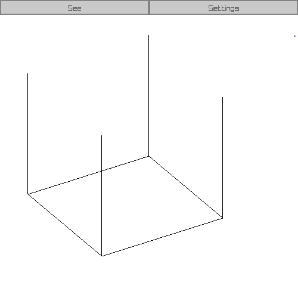
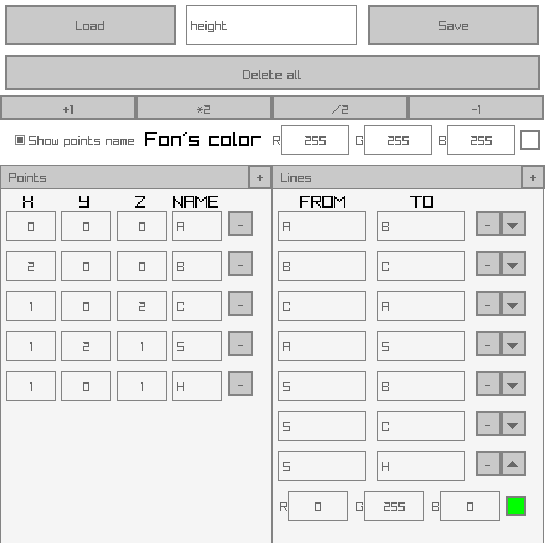

# See3DLine

## C++, [Raylib](https://github.com/raysan5/raylib) ([install](https://github.com/raylib-extras/game-premake)) and [Raygui](https://github.com/raysan5/raygui) (slightly modified)

# About the project

With it, you can see the three-dimensional shapes that are drawn in geometry lessons (faces only).

# About the display method

The program projects all the points onto viewing plane, and connects them correctly.

So it works very fast, but long distances don't work very well.

# More about the possibilities

You can edit the shape through the editor. And also save them and download ready-made ones

# How to run

## Download a ready-made solution

You can [download](https://github.com/3NikNikNik3/See3DLine/releases) the finished program

You can also download the prepared shapes, if you don't do this, the `shapes` folder will be created automatically

## Build it yourself

1) Download Raylib and setting up the environment. I usually use [this](https://github.com/raylib-extras/game-premake) (C++ files + VS)
2) Download [Raygui](https://github.com/raysan5/raygui/blob/master/src/raygui.h) and add it to the Raylib folder
3) Add string `#pragma once` to the beginning `raygui.h` (This is necessary so that `#include "raygui.h"` works in several files)(I couldn't do it any other way)
4) Download this project to the folder where the files should be located (if you used the link I gave, then this is the `game` folder)
5) (optional) Delete `ReadMe.md` and `images`
6) Compile

## Build with CMake ([page](https://github.com/raysan5/raylib/wiki/Working-on-GNU-Linux) helped me)

1) Creating a folder with a future project (all paths will be from here)
2) Download to this folder [Raylib](https://github.com/raysan5/raylib) (for example `git clone https://github.com/raysan5/raylib.git`)
3) Rename the folder with raylib to `raylib`
4) Download a separate file [raygui.h](https://github.com/raysan5/raygui/blob/master/src/raygui.h) to `raylib/src`
5) Add string `#pragma once` to the beginning `raygui.h`
6) Add string `raygui.h` to file `CMakeLists.txt` to folder `raylib/src` to define `raylib_public_headers` on strings 28-29
7) Run `make PLATFORM=PLATFORM_DESKTOP` on terminal in folder `raylib/src`
8) The resulting file `librarylib.a` is moved to the root
9) Download this project (for example `git clone https://github.com/3NikNikNik3/See3DLine.git`)
10) Run `cmake CMakeLists.txt -Bbuild` on terminal in folder `See3DLine`
11) Run `make` on terminal in folder `See3DLine/build`
12) The resulting file `See3DLine` is this program :)

[Ru version ReadMe](https://github.com/3NikNikNik3/See3DLine/tree/main/ReadMe_ru.md)