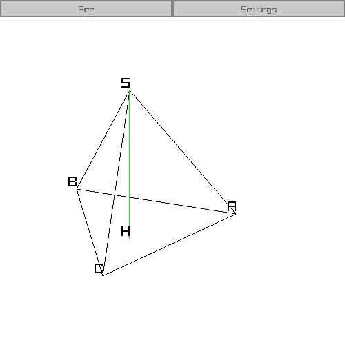

# See3DLine

## C++, [Raylib](https://github.com/raysan5/raylib) ([install](https://github.com/raylib-extras/game-premake)) and [Raygui](https://github.com/raysan5/raygui) (немного изменённый)

# О проекте

С его помощью Вы можете увидеть трёхмерные фигуры, которые рисуются на уроках геометрии (только грани).

# О способе отображения

Программа проецирует все точки на плоскость просмотра, и правильно их соединяет.

Таким образом это работает очень быстро, правда большие расстояния работают не очень.

# Ещё о возможностях

Вы можете редактировать фигуру через редактор. А также сохранять их и загружать уже готовые

# Как запустить

## Скачать готовое решение

Вы можете [скачать](https://github.com/3NikNikNik3/See3DLine/releases) готовую программу

Также можно скачать заготовленые фигуры, если этого не сделать, то папка `shapes` будет создана автоматически

## Собрать самому

1) Скачиваем Raylib и настраиваем среду. Я обычно пользуюсь [этим](https://github.com/raylib-extras/game-premake) (C++ файлы + VS)
2) Скачиваем [Raygui](https://github.com/raysan5/raygui/blob/master/src/raygui.h) и добавляем его в папку с Raylib
3) Добавляем в начало `raygui.h` строку `#pragma once` (Это нужно, чтобы `#include "raygui.h"` работал в нескольких файлах)(по другому у меня сделать не получилось)
4) Скачиваем этот проект в папку, где должны лежать файлы (если Вы пользовались ссылкой, которую я дал, то это папка `game`)
5) (опционально) Удаляем `ReadMe.md` и `images`
6) Компилируем